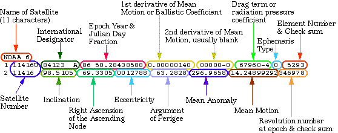

- [Hi SpaceApps participants!](#hi-spaceapps-participants)
  - [Satellite orbital data basics](#satellite-orbital-data-basics)
  - [Data retrieval](#data-retrieval)
  - [Rendering the orbital objects in WorldWind](#rendering-the-orbital-objects-in-worldwind)
  - [Additional resources](#additional-resources)
  - [Image references](#image-references)

## Hi SpaceApps participants!

As part of the [SpaceApps](https://www.spaceappschallenge.org/) hackathon, SpaceBirds is given as a resource for the [Orbital Scrap Metal](https://2020.spaceappschallenge.org/challenges/sustain/orbital-scrap-metal-the-video-game-v20/details) challenge since 2019.

**One of the requirements of the Orbital Scrap Metal challenge is to have real-world satellite information.** You can find an up-to-date dataset of all on-orbit objects in the [data folder](/data/), in three different file formats. These datasets may prove useful for you regardless of your software tools of choice.

[SpaceBirds](https://worldwind.arc.nasa.gov/spacebirds/) is a web application that displays all the objects tracked in Earth orbit in real time. You can see a demo on its usage [here](https://youtu.be/ojp8Tqf2j0k). It's based around the [NASA WorldWind 3D globe web library](https://worldwind.arc.nasa.gov/web) and the [Satellite.js](https://github.com/shashwatak/satellite-js) library.  It obtains the information of all the orbiting objects from a [public data source](https://www.space-track.org/) set up by the US government. If you want to see SpaceBirds source code, check [this point in the history](https://github.com/WorldWindLabs/SpaceBirds/tree/59b4790296e4c6c610145dd5f4119521012cf8d6) of the repository. 

Remember that using SpaceBirds or NASA WorldWind is not mandatory for you to participate in the **Orbital Scrap Metal challenge**. It is recommended that beginner teams create 2D games, or if you're familiar with a 3D game engine, you might prefer to use that instead. Try to stick with the tools and languages that you're familiar with.

In its current state, this repository contains a minimal satellite tracker to help you get you going with your project if you choose to leverage the geospatial power of NASA WorldWind. WorldWind is designed to be relatively easy to use, even for coders not too familiarized with web development. You can browse code examples for WorldWind [in here](https://worldwind.arc.nasa.gov/web/examples/).

If you're familiarized with HTML and JavaScript, you're good to go to modify SpaceBirds and use WorldWind. Being familiar with [Git](https://git-scm.com/) is not required, but it will help you to organize your coding and share the workload with your team members. Here are some good resources to get you started:

* [HTML Introduction](https://www.w3schools.com/html/html_intro.asp)
* [JavaScript basics](https://developer.mozilla.org/en-US/docs/Learn/Getting_started_with_the_web/JavaScript_basics)
* [Git - the simple guide](https://rogerdudler.github.io/git-guide/)

Parts of SpaceBirds may prove useful for you in order to understand how the orbiting objects' information is obtained and shown in an application in real time, and at the same time, it can teach you one thing or two about how satellites orbit the Earth and how can we know their current, past, and present position at any given time. If you want a challenge, you can attempt to *gamify* SpaceBirds itself to convert it into an orbital debris poaching videogame.

You can also learn what are the categories of orbiting objects, and how to define and distinguish **orbital debris** among them. The definition may not be as clear-cut as you initially thought!

### Satellite orbital data basics

First of all, let's go with [this definition of *satellite*](https://www.nasa.gov/audience/forstudents/5-8/features/nasa-knows/what-is-a-satellite-58.html):

> A satellite is a moon, planet or machine that orbits a planet or star.

In this case, we're focusing on artificial satellites that orbit the Earth. This includes spent rocket stages, derelict spacecraft, general debris, and payloads that are still operational.

One of the most recurring questions about SpaceBirds and other satellite tracker applications is "Does it obtain constant updates on where the satellites are located?"

For a simple (but still pretty accurate!) satellite tracker like this one, we don't need the satellites themselves to constantly inform us of their current location. Since they move throughout space more or less unimpeded once they're launched, and assuming that its orbit hasn't changed due to external influence (due to maneuvers from its operator, crash with debris, solar wind, *etc.*) we can estimate their future (or past) locations if we have their location, heading and speed at a given time.

To characterize the motion of an orbiting object, the six [Keplerian elements](https://solarsystem.nasa.gov/basics/chapter5-1/) are regularly used. For our purposes, these orbital elements describe the ellipse that the object follows while going around the Earth. If we then know the position of the object over that ellipse at any given time, we can know its past and future positions with a good degree of certainty if nothing is changing its speed or heading.

Back in the late 60s, NASA and NORAD came up with a computer-readable format to encode the orbital parameters of any Earth-orbiting object: [The Two Line Element set](https://spaceflight.nasa.gov/realdata/sightings/SSapplications/Post/JavaSSOP/SSOP_Help/tle_def.html) (or TLE). For our purposes it is not needed to understand everything about it, but here is is an explanation of the information contained in a TLE:

We can feed the TLE to a software function called a [propagator](https://en.wikipedia.org/wiki/Simplified_perturbations_models), which plots the orbit and estimates the position of the object at any given time. This estimation becomes less accurate the further we project it in time: The farthest in the past or in the future we estimate its position compared to the time of acquisition of the TLE, the less accurate the prediction becomes. Additionally, TLEs don't account for deliberate or accidental orbital changes. For these reasons, TLEs must be updated regularly in order to maintain our tracking within acceptable accuracy.

The [Satellite.js](https://github.com/shashwatak/satellite-js) library contains functions that propagate the orbit given a TLE. Given any date, they also return the position of a satellite in terms of latitude, longitude, and altitude. Since any geospatial visualization library operates around geographic coordinates, we can finally feed this information into something like [NASA WorldWind](https://worldwind.arc.nasa.gov/).

### Data retrieval

SpaceBirds obtains the information of the orbital objects from [https://www.space-track.org/](https://www.space-track.org/)

SpaceBirds retrieves the data about Earth's orbital environment from Space-track's web API. You need to create an account to be able to query the database. The API's documentation can be consulted [here](https://www.space-track.org/documentation#/api). 

The data comprises publicly available orbital parameters of objects tracked by the [United State's Air Force 18th Space Control Squadron](https://www.af.mil/News/Article-Display/Article/1335482/18th-space-control-squadron-keeping-watch-up-above/). Space-track's TLEs are updated regularly.

The query being requested to Space-track's API is:

https://www.space-track.org/basicspacedata/query/class/gp/decay_date/null-val/epoch/%3Enow-30/orderby/norad_cat_id/format/json

Remember to log into Space-track first to obtain the results of these queries. The same dataset can be retrieved with different formats, changing the last field. Give it a try:

https://www.space-track.org/basicspacedata/query/class/gp/decay_date/null-val/epoch/%3Enow-30/orderby/norad_cat_id/format/csv

https://www.space-track.org/basicspacedata/query/class/gp/decay_date/null-val/epoch/%3Enow-30/orderby/norad_cat_id/format/3le

As mentioned previously, you can find a copy of the data of those queries in the [data folder](/data/). As of **October 2nd 2020**, this comprises **19,824 on-orbit objects** with a radar cross-section (RCS) equal or above 5 cm; between payloads (operational and derelict), spent rocket stages, general space debris, and objects still waiting for classification.

### Rendering the orbital objects in WorldWind

That being said, if your interests lie alongside virtual terrestrial globes, general mapping applications, and Geospatial Information Systems (for instance, like the applications that real satellite controllers use at NASA and other space agencies) here is the description of how the satellite TLE data is translated into terms of latitude, longitude and altitude.

*to be completed...*

### Additional resources

WorldWind-compatible 3D models for the ISS and Sentinel-1A from ESA are included in the [resources folder](/resources/). A code example on how to display them can be seen [here](https://github.com/NASAWorldWind/WebWorldWind/blob/develop/examples/Collada.js), with its live example [here](https://github.com/NASAWorldWind/WebWorldWind/blob/develop/examples/Collada.js).

A file with data on groundstations is included in the [data folder](/data/). The source of this file is [JSatTrack](https://github.com/sgano/JSatTrak/tree/svn/trunk/data/groundstations) from [Shawn Gano](https://github.com/sgano).

### Image references
1. https://solarsystem.nasa.gov/basics/chapter5-1/
2. https://spaceflight.nasa.gov/realdata/sightings/SSapplications/Post/JavaSSOP/SSOP_Help/tle_def.html